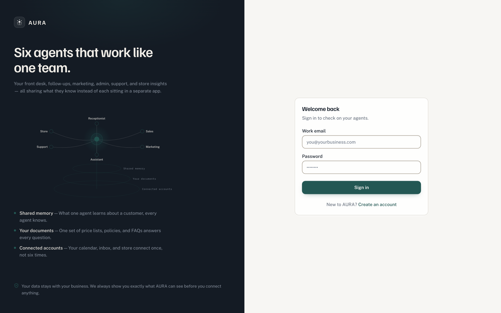
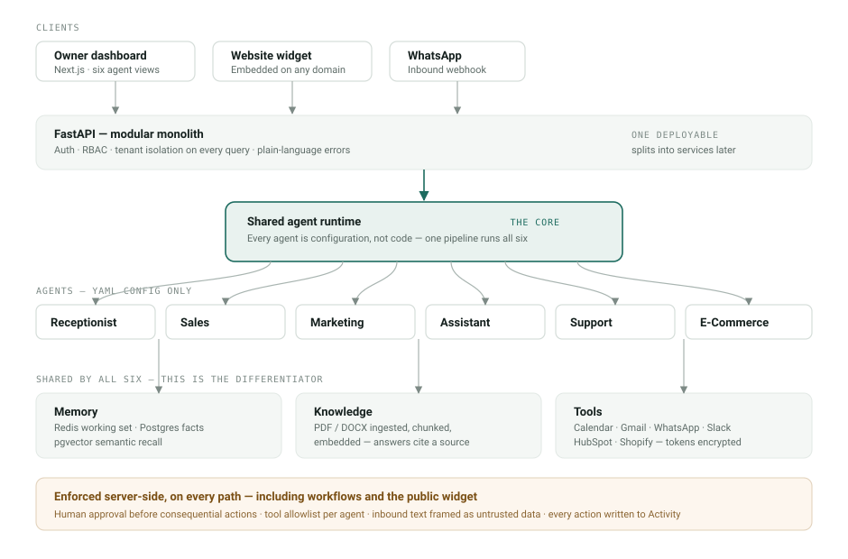
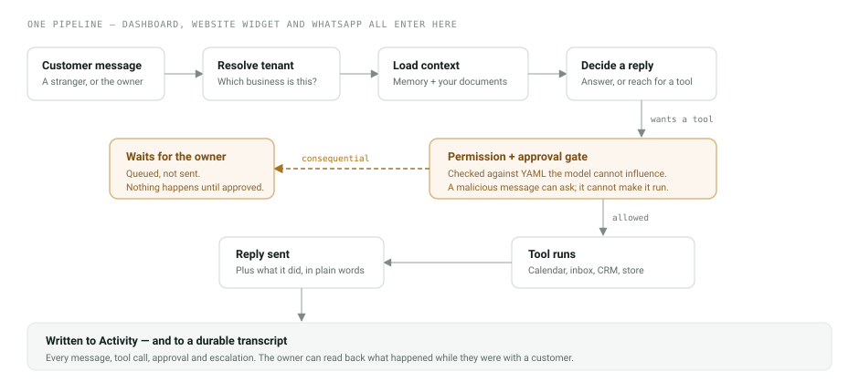
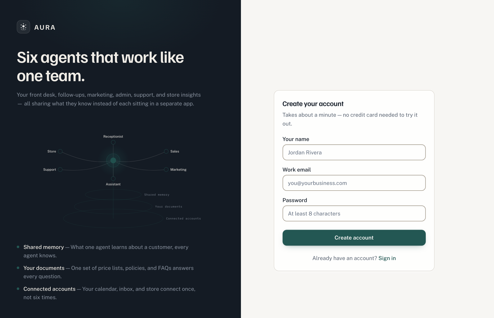

<div align="center">

# AURA

**Six AI agents that work like one team — not six chatbots in six tabs.**

A multi-tenant AI business operating system for small businesses: clinics, salons, agencies and small e-commerce brands. One shared runtime, one memory, one set of connected accounts.

<sub>FastAPI · Next.js 14 · PostgreSQL + pgvector · Redis · TypeScript · Three.js</sub>

<sub>117 backend tests · 6 agents · 40 API routes · 5 migrations · 14 eval scenarios</sub>

</div>

<br/>



<br/>

## The problem

A small clinic's leads arrive as messages — a WhatsApp at 9pm, an Instagram DM on Sunday, a web form nobody checks until Tuesday. Industry response time averages hours; a lead answered within five minutes converts several times better. Meanwhile the tools that promise to help arrive as six separate subscriptions that each know nothing about the others.

AURA answers on those channels, books into the calendar, and keeps working the relationship afterwards — with the owner able to see and approve everything consequential before it happens.

## Why it isn't six chatbots

The differentiator isn't "we have AI agents." It's that all six run on **one runtime, one memory, and one set of connected accounts**. What the Receptionist learns about a customer, the Assistant already knows. Your price list is uploaded once and answers every question. Your calendar connects once, not six times.

An agent here is **configuration, not code** — a prompt, a memory scope, a tool allowlist and an approval policy in a YAML file. Adding a seventh agent is a config file, not a new service.



## The part that matters most: it can't act behind your back

Every consequential action is gated **server-side**, against configuration the model cannot influence. A malicious document, a hostile WhatsApp message, or the model itself can *ask* to cancel an appointment. None of them can make it happen.



This holds on every path — the dashboard, the public website widget, and inside autonomous workflows. There is a test named `test_a_workflow_cannot_bypass_the_approval_gate` because that is exactly the hole worth worrying about.

| Guarantee | How it's enforced |
|---|---|
| **Human approval** before consequential actions | Server-side against YAML, re-checked at approve time so a stale approval can't be replayed |
| **Tenant isolation** | Every org-scoped query filtered by organization; membership verified on every request |
| **Untrusted input** | Documents, tool results and customer messages are delimited and framed as data, never instructions |
| **Tool allowlist** per agent | An agent cannot call a tool outside its config, even if the model asks |
| **Encrypted at rest** | Integration tokens use Fernet; production refuses to boot without a key |
| **Full audit trail** | Every message, tool call, approval and escalation written to Activity, in plain language |

## What's built

**Six agents** — Receptionist, Sales, Marketing, Executive Assistant, Support, E-Commerce Intelligence.

**Three inbound channels** — the owner dashboard, an embeddable website widget that runs on any customer domain, and a WhatsApp webhook.

**A workflow engine** — definitions stored in the database, scheduled and event triggers, steps that suspend and resume so a multi-day sequence survives a restart. Three templates ship: appointment reminder → no-show recovery → rebook offer, treatment recall, and new-enquiry escalation.

**Knowledge** — PDF and DOCX ingested, chunked, embedded into pgvector; answers cite the document they came from.

**Results and Activity** — one dashboard leading with recovered revenue, and a plain-language feed of everything the agents did.



## Quick start

Requires Python 3.11, Node 20, PostgreSQL 16+ with the `pgvector` extension, and Redis.

```bash
# 1. Services
createdb aura && psql -d aura -c "CREATE EXTENSION IF NOT EXISTS vector;"
redis-server &

# 2. Backend
cd apps/api
python -m venv .venv && source .venv/bin/activate
pip install -e ".[dev]"
cp .env.example .env          # fill in what you have — see below
alembic upgrade head
uvicorn src.main:app --reload --port 8000

# 3. Frontend (new terminal)
cd apps/web
cp .env.local.example .env.local
npm install && npm run dev
```

Then seed a realistic demo business so you're not looking at empty screens:

```bash
cd apps/api && python -m scripts.seed_demo
```

This creates **Riverside Dental** — an owner login, five patients, three ingested clinic documents, 24 conversations, three enabled workflows with run history, and one action waiting for approval. It prints the login details when it finishes. Safe to re-run.

### It works before you have any API keys

With no `OPENAI_API_KEY` set, the demo seed still ingests documents for real and the Receptionist still answers — it currently runs a **predefined menu flow** rather than free-form AI, so both the dashboard chat and the website widget are fully usable with zero credentials. Flipping back to real AI is one line: remove `chat_mode: scripted` from `apps/api/src/agents/configs/receptionist.yaml`. Nothing else changes — the UI falls back to free text automatically.

## Adding the chat widget to a website

One tag, pasted once, on any domain:

```html
<script src="https://your-aura-host/widget.js"
        data-org="YOUR_PUBLIC_ID"
        data-api="https://your-aura-api-host"></script>
```

Dependency-free, rendered in a closed shadow DOM so it can't leak styles into or out of the host page. Settings → Integrations shows the tag with your real id already filled in, plus a live preview and an on/off switch.

## Project layout

```
apps/
  api/                     FastAPI modular monolith
    src/
      identity/            Auth, organizations, RBAC, tenant isolation
      agents/
        runtime/           The shared pipeline every agent executes through
        configs/           Six YAML agents — prompt, tools, approval policy
        scripted/          Temporary predefined menu flow (see above)
      workflows/           Engine, stored definitions, scheduled runner
      memory/              Redis working set · Postgres facts · pgvector
      knowledge/           Ingestion, chunking, embedding, search
      tools/               Calendar, Gmail, WhatsApp, Slack, HubSpot, Shopify
      conversations/       Durable transcripts, contacts, human takeover
      evals/               14 scenarios incl. refusal and blocked-tool cases
      api/v1/              40 routes
  web/                     Next.js 14 dashboard + embeddable widget
docs/                      Architecture, customer profile, scope ledger
```

## Testing

```bash
cd apps/api && pytest        # 117 tests
cd apps/web && npm run lint && npm run build
```

Tests run on SQLite with a fake Redis, so no services are required. CI additionally runs the migration chain against real PostgreSQL, because pgvector operators are Postgres-only and SQLite hides that class of failure.

## Configuration

Everything in `apps/api/.env.example`. The essentials:

| Variable | Notes |
|---|---|
| `DATABASE_URL`, `REDIS_URL` | Required |
| `JWT_SECRET` | Required; production refuses the dev default |
| `ENCRYPTION_KEY` | Fernet key for integration tokens; production refuses to boot without it |
| `OPENAI_API_KEY` | Optional — see the note above on running without one |
| Provider tokens | Google, WhatsApp, Slack, HubSpot, Shopify — each optional; a tool without its credential returns a clean "not connected yet" instead of failing |

## Honest status

This is a **Phase 1 MVP**, and the repo is deliberately candid about where the edges are:

- **`docs/needs-founder-input.md`** — every item blocked on a credential, an account or a business decision, with exactly what's needed and why.
- **`docs/scope-ledger.md`** — every deviation from the original plan in *both* directions, including two defects that only surfaced when the whole stack was run the way a customer would use it, and the reasoning behind each temporary simplification.

Known and documented: no telephony, Google Calendar only (no practice-management-system integration yet), OAuth consent flows not built for most providers, and approval notifications currently log to console rather than email pending a provider key.

---

<div align="center">
<sub>Built as a modular monolith on purpose — every module is independently testable and splits into a service later without changing its boundaries.</sub>
</div>
